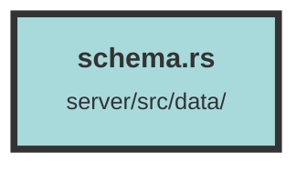

# schema.rs

### Purpose
This file defines the schema for various database tables using Diesel ORM in Rust. It includes table definitions, relationships, and configurations to facilitate database operations in a structured and type-safe manner.

### Flow
1. **Table Definitions**: Each `diesel::table!` macro defines a table with its columns and their data types. For example, the `chunk_collisions` table has columns like `id`, `chunk_id`, `collision_qdrant_id`, `created_at`, and `updated_at`.

2. **Relationships**: The `diesel::joinable!` macro specifies foreign key relationships between tables. For instance, `chunk_group` is related to `datasets` via `dataset_id`.

3. **Query Configuration**: The `diesel::allow_tables_to_appear_in_same_query!` macro lists tables that can be queried together, ensuring that the ORM can handle complex queries involving multiple tables.

This structure ensures that the database schema is well-defined, relationships are clear, and queries are optimized for performance and safety.

##### Auto generated documentation file from CodeViz.ai
