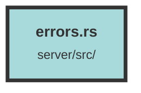

# errors.rs

### Purpose
The purpose of this file is to define a structured way to handle and respond to various service errors in a web application using the Actix-web framework. It includes custom error types, their corresponding HTTP responses, and conversions from other error types.

### Flow
1. **ErrorResponseBody Struct**: Defines the structure of the error response body with a single field `message`.

2. **ServiceError Enum**: Enumerates different types of service errors such as `InternalServerError`, `BadRequest`, `DuplicateTrackingId`, `Unauthorized`, `Forbidden`, and `NotFound`.

3. **ResponseError Implementation**: Implements the `ResponseError` trait for `ServiceError` to convert errors into appropriate HTTP responses. Each variant of `ServiceError` maps to a specific HTTP status code and a JSON response body.

4. **From Implementations**:
   - **From<ParseError>**: Converts a UUID parsing error into a `BadRequest` service error with a custom message.
   - **From<DBError>**: Converts a Diesel database error into either a `BadRequest` or `InternalServerError` based on the error kind, specifically handling unique constraint violations.

This structured approach ensures that errors are consistently handled and reported, improving the robustness and user experience of the application.

##### Auto generated documentation file from CodeViz.ai
