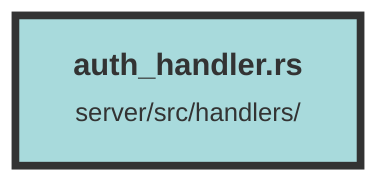

# auth_handler.rs

### Purpose
This file handles authentication and authorization processes, including OpenID Connect (OIDC) client setup, user login, logout, and account creation. It also defines roles and permissions for users within an organization.

### Flow
1. **Imports and Dependencies**: The file imports various modules and dependencies required for authentication, authorization, and web handling.

2. **Data Structures**:
   - `OpCallback`, `AFClaims`, `OpenIdConnectState`, `AuthQuery`, `LoginState`, `LogoutRequest`: Structs for handling various data related to authentication.
   - `LoggedUser`, `OrganizationRole`, `AdminOnly`, `OwnerOnly`: Structs and implementations for user roles and permissions.

3. **OIDC Client Setup**:
   - `build_oidc_client()`: Asynchronously builds and configures the OIDC client using environment variables.

4. **Account Creation**:
   - `create_account()`: Handles the creation of a new user account, including organization assignment and role determination.

5. **Logout**:
   - `logout()`: Invalidates the current authentication session and provides a logout URL for the OIDC provider.

6. **Login**:
   - `login()`: Redirects the user to the OAuth provider for authentication and sets up the session state.
   - `callback()`: Handles the callback from the OAuth provider, verifies the token, and sets the user session.

7. **User Information**:
   - `get_me()`: Retrieves the current authenticated user's information.

8. **Health Check**:
   - `health_check()`: Provides a health check endpoint to confirm the service is operational.

9. **CLI Login**:
   - `login_cli()`: Serves a local login page for CLI-based authentication.

##### Auto generated documentation file from CodeViz.ai
