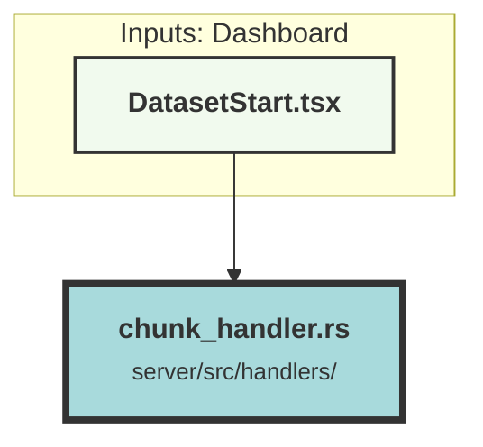

# chunk_handler.rs


### Purpose
This file defines various data structures and API endpoints for managing and interacting with chunks of data. It includes functionality for creating, updating, deleting, searching, and recommending chunks, as well as performing operations like autocomplete and generating responses based on chunks.

### Flow
1. **Data Structures**:
   - `ChunkData`: Represents the structure of a chunk, including fields like `chunk_html`, `link`, `tag_set`, `metadata`, etc.
   - `FailedChunk`, `ReturnQueuedChunk`, `SingleQueuedChunkResponse`, `BatchQueuedChunkResponse`: Structures for handling responses and errors related to chunk operations.
   - `UploadIngestionMessage`, `BulkUploadIngestionMessage`: Structures for handling bulk upload messages.
   - `CreateSingleChunkData`, `CreateBatchChunkData`, `CreateChunkData`: Structures for creating single or batch chunks.
   - `UpdateChunkData`, `UpdateIngestionMessage`, `UpdateChunkByTrackingIdData`: Structures for updating chunks.
   - `ChunkFilter`, `SearchChunkData`, `SearchChunkQueryResponseBody`, `ParsedQuery`: Structures for searching chunks.
   - `AutocompleteData`, `RecommendChunksRequest`, `GenerateChunksRequest`: Structures for autocomplete, recommendation, and generation requests.

2. **API Endpoints**:
   - `create_chunk`: Creates or upserts a chunk or multiple chunks. Validates the number of chunks and dataset limits before queuing the chunks for ingestion.
   - `delete_chunk`: Deletes a chunk by its ID.
   - `delete_chunk_by_tracking_id`: Deletes a chunk by its tracking ID.
   - `update_chunk`: Updates a chunk by its ID or tracking ID.
   - `update_chunk_by_tracking_id`: Updates a chunk by its tracking ID (deprecated).
   - `search_chunks`: Searches for chunks based on semantic, full-text, or hybrid search types.
   - `autocomplete`: Provides autocomplete functionality for chunks.
   - `get_chunk_by_id`: Retrieves a chunk by its ID.
   - `get_chunk_by_tracking_id`: Retrieves a chunk by its tracking ID.
   - `get_chunks_by_ids`: Retrieves multiple chunks by their IDs.
   - `get_chunks_by_tracking_ids`: Retrieves multiple chunks by their tracking IDs.
   - `get_recommended_chunks`: Recommends chunks similar to the provided positive examples and dissimilar to the negative examples.
   - `generate_off_chunks`: Generates a response based on the provided chunks and previous messages using a language model.

3. **Helper Functions**:
   - `parse_query`: Parses a search query to extract quoted and negated words.
   - `convert_html_to_text`: Converts HTML content to plain text for processing.

4. **External Dependencies**:
   - Uses various external crates like `actix_web`, `chrono`, `serde`, `serde_json`, `regex`, `tokio_stream`, and others for handling web requests, date-time operations, serialization, and more.
   - Integrates with external services like OpenAI for language model operations.
```

##### Auto generated documentation file from CodeViz.ai
