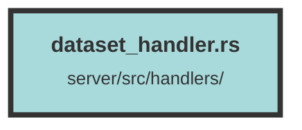

# dataset_handler.rs

### Purpose
This file defines the API endpoints for managing datasets within an organization. It includes functionality for creating, updating, deleting, and retrieving datasets, as well as handling dataset configurations.

### Flow
1. **Imports and Dependencies**: The file imports necessary modules and dependencies, including models, error handling, and operators for dataset and organization operations.

2. **FromRequest Implementation**: Implements the `FromRequest` trait for `DatasetAndOrgWithSubAndPlan` to extract dataset information from the request.

3. **CreateDatasetRequest Struct**: Defines the structure for creating a dataset, including dataset name, organization ID, tracking ID, and configurations.

4. **create_dataset Function**: Handles the creation of a new dataset. It checks the organization's subscription plan and dataset count before creating a new dataset.

5. **UpdateDatasetRequest Struct**: Defines the structure for updating a dataset, including optional fields for dataset ID, tracking ID, name, and configurations.

6. **update_dataset Function**: Handles updating an existing dataset. It retrieves the current dataset by ID or tracking ID and updates the provided fields.

7. **delete_dataset Function**: Handles deleting a dataset by its ID. It retrieves the server configuration and deletes the dataset.

8. **delete_dataset_by_tracking_id Function**: Handles deleting a dataset by its tracking ID. Similar to `delete_dataset`, but uses the tracking ID for retrieval.

9. **get_dataset Function**: Retrieves a dataset by its ID. It requires the user to be an admin or owner of the organization.

10. **get_dataset_by_tracking_id Function**: Retrieves a dataset by its tracking ID. Similar to `get_dataset`, but uses the tracking ID for retrieval.

11. **get_datasets_from_organization Function**: Retrieves all datasets for a given organization. It requires the user to be an admin or owner of the organization.

12. **get_client_dataset_config Function**: Retrieves the client configuration for a dataset. It uses the dataset information from the request.

Each function is annotated with `#[utoipa::path]` for API documentation and `#[tracing::instrument]` for tracing.

##### Auto generated documentation file from CodeViz.ai
