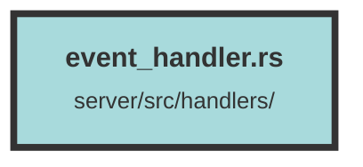

# event_handler.rs

### Purpose
The purpose of this file is to define an API endpoint for retrieving events related to a specific dataset. It includes the necessary data structures, request handling, and response formatting to facilitate this functionality.

### Flow
1. **Data Structures**: 
   - `GetEventsData`: Defines the structure for the request payload, including pagination and event type filters.
   - `EventId`: Represents the ID of a notification.

2. **Endpoint Definition**:
   - The `get_events` function is an asynchronous handler for the `/events` endpoint. It is annotated with `utoipa::path` to provide OpenAPI documentation.

3. **Request Handling**:
   - The function accepts a logged-in user, dataset information, request payload, and a database connection pool.
   - It processes the `event_types` from the request, defaulting to all event types if none are specified.

4. **Query Execution**:
   - The `get_events_query` function is called to fetch events from the database based on the provided dataset ID, pagination, and event types.
   - Errors during query execution are mapped to a `ServiceError::BadRequest`.

5. **Response**:
   - On success, the function returns a JSON response with the retrieved events.
   - The endpoint supports two response statuses: 200 for successful retrieval and 400 for service errors.

##### Auto generated documentation file from CodeViz.ai
