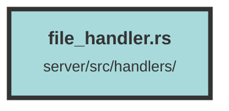

# file_handler.rs

### Purpose
This file handles various file-related operations such as uploading, downloading, and deleting files. It also includes functionalities for validating file names, managing file metadata, and handling file-related requests in a web server context.

### Flow
1. **Imports and Dependencies**: The file imports necessary modules and dependencies, including authentication handlers, data models, error handling, file operations, and web server utilities.

2. **File Name Validation**: The `validate_file_name` function ensures that the file name does not contain invalid characters like "..".

3. **Upload File**: The `upload_file_handler` function handles file uploads. It validates the file, decodes the base64 content, uploads it to an S3 bucket, and pushes a message to Redis for further processing.

4. **Get File**: The `get_file_handler` function retrieves a file based on its ID. It checks if the document download feature is enabled and fetches the file from the database.

5. **Get Files for Dataset**: The `get_dataset_files_handler` function retrieves all files belonging to a specified dataset, paginated by 10 files per page.

6. **Delete File**: The `delete_file_handler` function deletes a file from the S3 bucket and disassociates its chunks. It requires admin or owner permissions.

7. **Get Signed URL**: The `get_signed_url` function generates a signed URL for accessing a file in the S3 bucket.

8. **Get PDF from Range**: The `get_pdf_from_range` function generates a PDF from a range of image files. If OCR is enabled, it performs OCR on the generated PDF.

Each handler function is annotated with `#[tracing::instrument]` for tracing and logging purposes, and they use Actix Web for handling HTTP requests and responses.

##### Auto generated documentation file from CodeViz.ai
