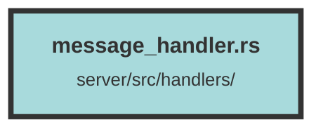

# message_handler.rs

### Purpose
This file contains the implementation of various handlers for managing messages in a chat system. It includes functionalities for creating, editing, regenerating, and retrieving messages, as well as generating suggested queries based on user input.

### Flow
1. **Imports and Dependencies**: The file imports necessary modules and dependencies, including models, operators, and external libraries like `actix_web`, `serde`, and `openai_dive`.

2. **Data Structures**:
   - `CreateMessageData`: Defines the structure for creating a new message.
   - `RegenerateMessageData`: Defines the structure for regenerating a message.
   - `EditMessageData`: Defines the structure for editing a message.
   - `SuggestedQueriesRequest` and `SuggestedQueriesResponse`: Define the structures for generating suggested queries.

3. **Handlers**:
   - `create_message_completion_handler`: Handles the creation of a new message. It checks the user's plan, validates the topic, retrieves previous messages, and streams the response.
   - `get_all_topic_messages`: Retrieves all messages for a given topic, ensuring the user owns the topic.
   - `edit_message_handler`: Edits an existing message by deleting it and creating a new one based on the provided content.
   - `regenerate_message_handler`: Regenerates the last assistant message for a topic by deleting it and creating a new one.
   - `create_suggested_queries_handler`: Generates suggested queries based on the provided query and returns them as a JSON object.

4. **Helper Functions**:
   - `get_topic_string`: Generates a topic string based on the first message.
   - `stream_response`: Streams the response for a message, including handling chunk metadata and calling the LLM API for generating responses.

5. **Annotations and Instrumentation**: The file uses `utoipa` for API documentation and `tracing` for instrumentation, providing detailed information about each endpoint and its parameters.

6. **Error Handling**: The handlers and helper functions include error handling to manage various failure scenarios, such as unauthorized access, bad requests, and internal server errors.

##### Auto generated documentation file from CodeViz.ai
