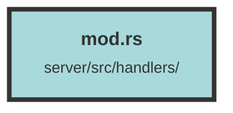

# mod.rs

### Purpose
This file serves as a module declaration for a Rust project. It organizes and exposes various handlers that manage different aspects of the application.

### Flow
The file declares multiple modules using the `pub mod` keyword, making them publicly accessible. Each module likely contains specific functionality related to its name, such as `auth_handler` for authentication, `file_handler` for file operations, and `user_handler` for user management. This modular approach helps in maintaining a clean and organized codebase.

##### Auto generated documentation file from CodeViz.ai
