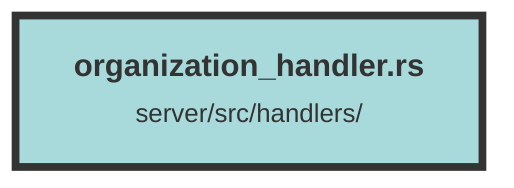

# organization_handler.rs

### Purpose
This file defines a set of API endpoints for managing organizations within a system. It includes functionalities for creating, updating, deleting, and fetching details about organizations, as well as managing users within those organizations.

### Flow
1. **Get Organization by ID**
   - **Endpoint:** `GET /organization/{organization_id}`
   - **Authorization:** Admin or Owner
   - **Function:** `get_organization_by_id`
   - **Description:** Fetches details of an organization by its ID.

2. **Delete Organization by ID**
   - **Endpoint:** `DELETE /organization/{organization_id}`
   - **Authorization:** Owner
   - **Function:** `delete_organization_by_id`
   - **Description:** Deletes an organization by its ID.

3. **Update Organization**
   - **Endpoint:** `PUT /organization`
   - **Authorization:** Owner
   - **Function:** `update_organization`
   - **Description:** Updates an organization's details.

4. **Create Organization**
   - **Endpoint:** `POST /organization`
   - **Authorization:** Logged User
   - **Function:** `create_organization`
   - **Description:** Creates a new organization.

5. **Get Organization Usage**
   - **Endpoint:** `GET /organization/usage/{organization_id}`
   - **Authorization:** Admin or Owner
   - **Function:** `get_organization_usage`
   - **Description:** Fetches the current usage of an organization by its ID.

6. **Get Organization Users**
   - **Endpoint:** `GET /organization/users/{organization_id}`
   - **Authorization:** Admin or Owner
   - **Function:** `get_organization_users`
   - **Description:** Fetches users of an organization by its ID.

7. **Remove User from Organization**
   - **Endpoint:** `DELETE /organization/{organization_id}/user/{user_id}`
   - **Authorization:** Admin or Owner
   - **Function:** `remove_user_from_org`
   - **Description:** Removes a user from an organization.

##### Auto generated documentation file from CodeViz.ai
