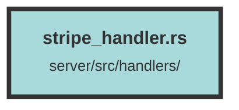

# stripe_handler.rs

### Purpose
This file handles various Stripe-related operations such as webhook processing, payment link generation, subscription management, and plan retrieval. It integrates with Stripe's API to manage subscriptions and payments for an organization.

### Flow
1. **Webhook Handling**:
   - The `webhook` function processes incoming Stripe webhook events.
   - It verifies the Stripe signature and parses the event payload.
   - Depending on the event type (`CheckoutSessionCompleted`, `PlanCreated`, `CustomerSubscriptionDeleted`), it performs actions like creating subscriptions, updating plans, or setting subscription end dates.

2. **Direct Payment Link**:
   - The `direct_to_payment_link` function generates a direct link to the Stripe checkout page.
   - It checks for existing subscriptions and retrieves the plan and organization details.
   - It then creates a payment link and redirects the user to the Stripe checkout page.

3. **Cancel Subscription**:
   - The `cancel_subscription` function cancels a subscription by its ID.
   - It retrieves the subscription details and calls Stripe's API to cancel the subscription.

4. **Update Subscription Plan**:
   - The `update_subscription_plan` function updates an existing subscription to a new plan.
   - It retrieves the subscription and plan details and updates the subscription in Stripe.

5. **Get All Plans**:
   - The `get_all_plans` function retrieves a list of all available plans.
   - It queries the database and returns the list of plans in JSON format.

##### Auto generated documentation file from CodeViz.ai
