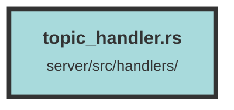

# topic_handler.rs

### Purpose
This file defines the API endpoints for managing chat topics. It includes functionalities to create, delete, update, and retrieve topics associated with a user. These topics act as coordinators for conversation message history in gen-AI chat sessions.

### Flow
1. **Create Topic**:
   - Endpoint: `POST /api/topic`
   - Accepts a JSON payload (`CreateTopicData`) to create a new topic.
   - Generates a topic name from the first user message if not provided.
   - Calls `create_topic_query` to insert the new topic into the database.
   - Returns the created topic as a JSON response.

2. **Delete Topic**:
   - Endpoint: `DELETE /api/topic/{topic_id}`
   - Accepts a topic ID as a path parameter.
   - Calls `delete_topic_query` to remove the topic and its associated messages from the database.
   - Returns a `204 No Content` response on success.

3. **Update Topic**:
   - Endpoint: `PUT /api/topic`
   - Accepts a JSON payload (`UpdateTopicData`) to update an existing topic's name.
   - Calls `update_topic_query` to update the topic name in the database.
   - Returns a `204 No Content` response on success.

4. **Get All Topics for Owner ID**:
   - Endpoint: `GET /api/topic/owner/{owner_id}`
   - Accepts an owner ID as a path parameter.
   - Calls `get_all_topics_for_owner_id_query` to retrieve all topics associated with the given owner ID.
   - Returns the list of topics as a JSON response.

##### Auto generated documentation file from CodeViz.ai
