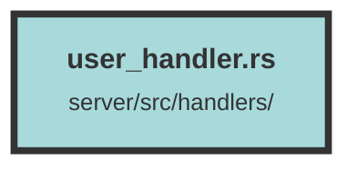

# user_handler.rs

### Purpose
This file defines several API endpoints for managing user roles and API keys within an organization. It includes functionality for updating user roles, creating, retrieving, and deleting API keys.

### Flow
1. **Update User Role (`update_user`)**:
   - Endpoint: `PUT /api/user`
   - Validates the requesting user's role and updates the role of a specified user within an organization.
   - Checks if the user is authorized to perform the update and if the target user is part of the organization.
   - Uses `update_user_org_role_query` to update the role in the database.

2. **Set User API Key (`set_user_api_key`)**:
   - Endpoint: `POST /api/user/api_key`
   - Creates a new API key for the authenticated user.
   - Validates the role assigned to the API key.
   - Uses `set_user_api_key_query` to store the new API key in the database.
   - Returns the newly created API key.

3. **Get User API Keys (`get_user_api_keys`)**:
   - Endpoint: `POST /api/user/api_key`
   - Retrieves all API keys associated with the authenticated user.
   - Uses `get_user_api_keys_query` to fetch the API keys from the database.
   - Returns a list of API keys without the actual key values.

4. **Delete User API Key (`delete_user_api_key`)**:
   - Endpoint: `DELETE /api/user/api_key/{api_key_id}`
   - Deletes a specified API key for the authenticated user.
   - Uses `delete_user_api_keys_query` to remove the API key from the database.
   - Returns a `NoContent` response upon successful deletion.

##### Auto generated documentation file from CodeViz.ai
