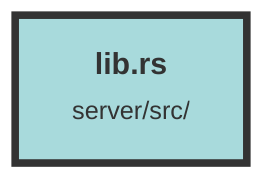

# lib.rs

### Purpose
This file serves as the main entry point for a web server application built using the Actix Web framework. It configures and runs the server, sets up database connections, handles migrations, and defines various routes and services for the application.

### Flow
1. **Imports and Dependencies**: The file begins by importing necessary crates and modules, including Diesel for database interactions, OpenSSL for SSL/TLS, and Actix Web for the web server.

2. **Constants and Migrations**: Constants for time durations are defined. The `run_migrations` function is used to run database migrations synchronously.

3. **Database Connection**: The `establish_connection` function sets up an asynchronous PostgreSQL connection with SSL/TLS support.

4. **OpenAPI Documentation**: The `SecurityAddon` struct and `ApiDoc` struct are used to define and modify the OpenAPI documentation for the API.

5. **Main Function**: 
    - **Environment Setup**: Loads environment variables using `dotenvy`.
    - **Sentry Integration**: Initializes Sentry for error tracking if the `SENTRY_URL` environment variable is set.
    - **Database and Redis Setup**: Establishes database and Redis connections and pools.
    - **OIDC Client**: Builds an OpenID Connect client.
    - **Qdrant Collection**: Optionally creates a new Qdrant collection for vector quantization.
    - **Default User**: Optionally creates a default user if the `ADMIN_API_KEY` environment variable is set.

6. **HTTP Server**: 
    - **Configuration**: Configures the Actix Web server with various middlewares, including CORS, session management, and logging.
    - **Routes and Services**: Defines routes and services for different API endpoints, including authentication, user management, dataset management, chunk management, file handling, and more.
    - **Swagger and Redoc**: Sets up Swagger UI and Redoc for API documentation.

7. **Server Binding**: Binds the server to `0.0.0.0:8090` and runs it.

##### Auto generated documentation file from CodeViz.ai
