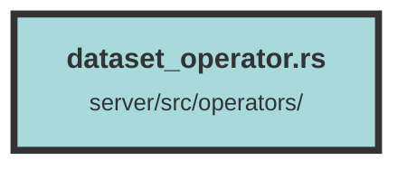

# dataset_operator.rs

### Purpose
This file contains a set of asynchronous functions for managing datasets within a web service. These functions handle creating, retrieving, updating, and deleting datasets, as well as fetching datasets by organization ID. The operations interact with a database and, in some cases, an external Qdrant service.

### Flow
1. **create_dataset_query**: Inserts a new dataset into the database.
   - Uses `diesel::insert_into` to add the dataset.
   - Returns the newly created dataset.

2. **get_dataset_by_id_query**: Retrieves a dataset by its ID.
   - Supports two types of IDs: `TrieveUuid` and `TrackingId`.
   - Uses `diesel::filter` and `select` to fetch the dataset.
   - Returns the dataset if found.

3. **get_dataset_and_organization_from_dataset_id_query**: Fetches a dataset along with its associated organization, subscription, and plan.
   - Joins multiple tables: datasets, organizations, stripe_subscriptions, and stripe_plans.
   - Filters by dataset ID and returns a combined result.

4. **delete_dataset_by_id_query**: Deletes a dataset by its ID.
   - Connects to Qdrant to delete related points.
   - Uses `diesel::delete` to remove the dataset from the database.

5. **update_dataset_query**: Updates an existing dataset.
   - Uses `diesel::update` to modify dataset fields.
   - Returns the updated dataset.

6. **get_datasets_by_organization_id**: Retrieves all datasets for a given organization ID.
   - Joins datasets with dataset usage counts.
   - Filters by organization ID and returns a list of datasets with usage information.

##### Auto generated documentation file from CodeViz.ai
