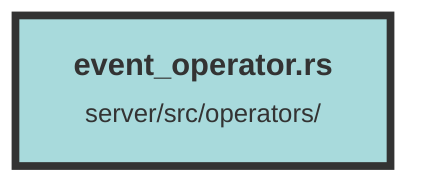

# event_operator.rs

### Purpose
This file contains functions to handle database operations related to events. It includes functionality to create a new event and retrieve a list of events with pagination and filtering options.

### Flow
1. **create_event_query**:
   - **Purpose**: Inserts a new event into the database.
   - **Flow**:
     - Receives an `Event` object and a database connection pool.
     - Acquires a database connection from the pool.
     - Inserts the event into the `events` table.
     - Logs an error and returns a `ServiceError` if the insertion fails.
     - Returns `Ok(())` on success.

2. **get_events_query**:
   - **Purpose**: Retrieves a list of events based on dataset ID, page number, page size, and event types.
   - **Flow**:
     - Receives dataset ID, page number, page size, event types, and a database connection pool.
     - Acquires a database connection from the pool.
     - Joins the `events` table with `dataset_event_counts` to get event counts.
     - Filters events by dataset ID and event types.
     - Orders events by creation date in descending order.
     - Applies pagination using `limit` and `offset`.
     - Loads the events and their counts from the database.
     - Maps the results to an `EventReturn` struct containing the events and page count.
     - Returns the `EventReturn` struct or a `ServiceError` if the query fails.

##### Auto generated documentation file from CodeViz.ai
