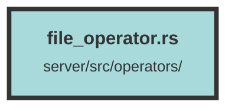

# file_operator.rs

### Purpose
This file contains functions for handling various operations related to files, such as creating, retrieving, and deleting files, as well as managing file chunks and AWS S3 bucket interactions.

### Flow
1. **get_aws_bucket**: 
   - Retrieves AWS S3 bucket configuration using environment variables.
   - Creates and returns an S3 bucket instance with appropriate credentials.

2. **create_file_query**:
   - Inserts a new file record into the database.
   - Uses provided file details and database connection pool to create the file.

3. **create_chunks_with_handler**:
   - Converts HTML content to text and chunks it.
   - Creates a chunk group and associates it with the file.
   - Validates chunk count against the organization's plan.
   - Serializes chunk metadata and pushes it to a Redis queue.
   - Logs a file upload event.

4. **get_file_query**:
   - Retrieves file metadata from the database using file UUID and dataset ID.
   - Generates a presigned URL for the file from the S3 bucket.
   - Returns the file metadata along with the S3 URL.

5. **get_dataset_file_query**:
   - Retrieves a paginated list of files for a given dataset.
   - Joins file data with group information and returns the result.

6. **delete_file_query**:
   - Deletes a file from the S3 bucket and the database.
   - Ensures the deletion is performed within a database transaction for consistency.

##### Auto generated documentation file from CodeViz.ai
