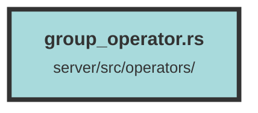

# group_operator.rs

### Purpose
This file contains a set of asynchronous functions for managing `ChunkGroup` entities in a dataset. These functions handle CRUD operations, querying, and other related tasks for chunk groups, bookmarks, and associated metadata within a dataset.

### Flow
1. **Get Group by Tracking ID**: `get_group_from_tracking_id_query` retrieves a `ChunkGroup` based on a tracking ID and dataset UUID.
2. **Get Group IDs by Tracking IDs**: `get_group_ids_from_tracking_ids_query` fetches a list of group IDs corresponding to a list of tracking IDs.
3. **Update Group by Tracking ID**: `update_group_by_tracking_id_query` updates the name and description of a group identified by a tracking ID.
4. **Create Group**: `create_group_query` creates a new `ChunkGroup` or updates an existing one if `upsert_by_tracking_id` is true.
5. **Get Groups for Dataset**: `get_groups_for_specific_dataset_query` retrieves groups for a specific dataset, with pagination support.
6. **Get Group by ID**: `get_group_by_id_query` fetches a `ChunkGroup` by its ID and dataset UUID.
7. **Delete Group by ID**: `delete_group_by_id_query` deletes a group and optionally its associated chunks.
8. **Update Chunk Group**: `update_chunk_group_query` updates the details of a `ChunkGroup`.
9. **Create Chunk Bookmark**: `create_chunk_bookmark_query` creates a bookmark for a chunk within a group.
10. **Get Bookmarks for Group**: `get_bookmarks_for_group_query` retrieves bookmarks for a group, with pagination support.
11. **Get Groups for Bookmark**: `get_groups_for_bookmark_query` fetches groups associated with specific chunk IDs.
12. **Delete Chunk from Group**: `delete_chunk_from_group_query` removes a chunk from a group.
13. **Create Group from File**: `create_group_from_file_query` associates a file with a group.
14. **Get Point IDs from Group IDs**: `get_point_ids_from_unified_group_ids` retrieves point IDs from a list of group IDs.
15. **Get Groups from Group IDs**: `get_groups_from_group_ids_query` fetches `ChunkGroup` entities based on a list of group IDs.
16. **Check Group IDs Exist**: `check_group_ids_exist_query` checks if a list of group IDs exists within a dataset.

##### Auto generated documentation file from CodeViz.ai
