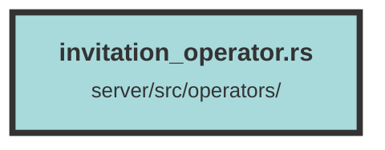

# invitation_operator.rs

### Purpose
This file contains functions to manage invitations within an organization. It includes creating, retrieving, sending, validating, and deleting invitations using Diesel ORM and Actix Web.

### Flow
1. **create_invitation_query**: Inserts a new invitation into the database.
   - Creates a new `Invitation` object.
   - Inserts it into the `invitations` table.
   - Returns the inserted invitation or an error.

2. **get_invitation_by_id_query**: Retrieves an invitation by its ID.
   - Queries the `invitations` table for the specified ID.
   - Returns the invitation or an error.

3. **send_invitation**: Sends an invitation email.
   - Formats the invitation email content.
   - Uses `send_email` to send the email to the specified address.

4. **set_invitation_used**: Marks an invitation as used.
   - Updates the `used` field of the specified invitation to `true`.
   - Returns success or an error.

5. **check_inv_valid**: Validates an invitation.
   - Retrieves the invitation by its code.
   - Checks if the email and organization ID match.
   - Ensures the invitation has not been used.
   - Marks the invitation as used.
   - Returns the invitation or an error.

6. **get_invitations_for_organization_query**: Retrieves all invitations for a specific organization.
   - Queries the `invitations` table for the specified organization ID.
   - Returns a list of invitations or an error.

7. **delete_invitation_by_id_query**: Deletes an invitation by its ID.
   - Deletes the specified invitation from the `invitations` table.
   - Returns success or an error.

##### Auto generated documentation file from CodeViz.ai
