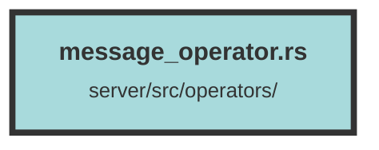

# message_operator.rs

### Purpose
This file contains a set of asynchronous functions for managing messages and topics within a chat application. It includes operations for retrieving, creating, and deleting messages, as well as verifying user ownership of topics.

### Flow
1. **Data Models and Imports**: The file imports necessary modules, data models (`Message`, `Topic`, `Pool`), and error handling utilities (`ServiceError`). It also uses `actix_web` for web data handling, `diesel_async` for asynchronous database operations, and `serde` for serialization and deserialization.

2. **Data Transfer Object (DTO)**: 
   - `ChatCompletionDTO`: A struct for serializing and deserializing chat completion data, including the message and token count.

3. **Functions**:
   - **`get_topic_messages`**: Retrieves messages for a given topic and dataset, filtering out deleted messages and ordering them by `sort_order`.
   - **`user_owns_topic_query`**: Checks if a user owns a specific topic within a dataset by querying the `topics` table.
   - **`create_message_query`**: Inserts a new message into the `messages` table.
   - **`create_generic_system_message`**: Generates a system message for a given topic and dataset.
   - **`create_topic_message_query`**: Handles the creation of a new message within a topic, including the generation of a system message if no previous messages exist.
   - **`get_message_by_sort_for_topic_query`**: Retrieves a specific message by its sort order within a topic and dataset.
   - **`get_messages_for_topic_query`**: Retrieves all messages for a given topic and dataset, ordered by `sort_order`.
   - **`delete_message_query`**: Marks messages as deleted for a given topic and dataset, starting from a specific message's sort order.

Each function uses a database connection from the `Pool` and handles errors by returning a `ServiceError` if any database operation fails.

##### Auto generated documentation file from CodeViz.ai
