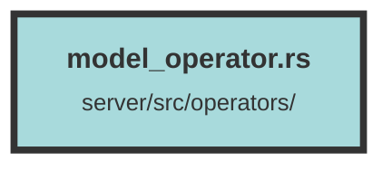

# model_operator.rs

### Purpose
This file contains functions for creating and retrieving embeddings, both dense and sparse, from various embedding servers. It also includes a cross-encoder function for re-ranking results based on a query.

### Flow
1. **EmbeddingParameters Struct**: Defines the parameters required for embedding, including the input text and model ID.

2. **create_embedding Function**: 
   - Initializes a Sentry transaction for tracing.
   - Retrieves the embedding API key and base URL.
   - Prepares the input message based on the `embed_type`.
   - Sends a request to the embedding server and processes the response.
   - Returns the dense embedding vector or an error.

3. **get_sparse_vector Function**: 
   - Determines the server origin based on `embed_type`.
   - Sends a request to the sparse embedding server.
   - Processes the response and returns the sparse embedding vector or an error.

4. **create_embeddings Function**: 
   - Similar to `create_embedding` but processes multiple messages in chunks of 30.
   - Sends requests to the embedding server for each chunk and collects the responses.
   - Returns a list of dense embedding vectors or an error.

5. **get_sparse_vectors Function**: 
   - Similar to `get_sparse_vector` but processes multiple messages in chunks of 30.
   - Sends requests to the sparse embedding server for each chunk and collects the responses.
   - Returns a list of sparse embedding vectors or an error.

6. **cross_encoder Function**: 
   - Initializes a Sentry transaction for tracing.
   - Prepares the request documents by converting HTML to text.
   - Sends a request to the cross-encoder server for re-ranking.
   - Processes the response and updates the scores of the results.
   - Returns the re-ranked results or an error.

##### Auto generated documentation file from CodeViz.ai
