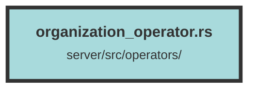

# organization_operator.rs

### Purpose
This file contains a set of asynchronous functions to manage organizations within a web application. These functions handle creating, updating, deleting, and retrieving organizations and their associated data, such as users, datasets, and usage counts.

### Flow
1. **create_organization_query**: Attempts to create an organization with a given name. If the name conflicts, it generates a random name and retries until successful.
2. **update_organization_query**: Updates an organization's name and clears associated user data from Redis.
3. **delete_organization_query**: Deletes an organization, its datasets, and any associated subscriptions, ensuring no active subscriptions exist.
4. **get_org_from_id_query**: Retrieves an organization along with its subscription and plan details by organization ID.
5. **get_org_dataset_count**: Fetches the count of datasets associated with an organization.
6. **get_user_org_count**: Retrieves the count of users in an organization.
7. **get_message_org_count**: Gets the count of messages associated with an organization.
8. **get_file_size_sum_org**: Fetches the total file storage size used by an organization.
9. **get_org_usage_by_id_query**: Retrieves detailed usage statistics for an organization.
10. **get_org_users_by_id_query**: Fetches a list of users associated with an organization.
11. **get_arbitrary_org_owner_from_org_id**: Retrieves an arbitrary owner-level user for a given organization.
12. **get_arbitrary_org_owner_from_dataset_id**: Retrieves an arbitrary owner-level user for the organization associated with a given dataset.

##### Auto generated documentation file from CodeViz.ai
