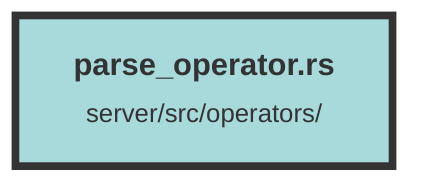

# parse_operator.rs

### Purpose
This file contains functions for processing HTML content, chunking text documents, and averaging embeddings. It includes utilities for converting HTML to plain text, splitting text into manageable chunks, and computing the average of a list of embeddings.

### Flow
1. **convert_html_to_text**: 
   - Converts an HTML string into plain text.
   - Uses the `scraper` crate to parse the HTML and extract text content.

2. **coarse_remove_large_chunks**:
   - Splits large text chunks into smaller ones if they exceed a specified length.
   - Iterates through the chunks, splitting them while ensuring character boundaries are respected.

3. **coarse_doc_chunker**:
   - Processes a document string by removing newlines and parsing it as HTML.
   - Splits the text into sentences using a regex and groups them into chunks of a target size.
   - Calls `coarse_remove_large_chunks` to ensure no chunk exceeds the maximum length.

4. **average_embeddings**:
   - Computes the average of a list of embeddings.
   - Uses the `ndarray` crate to handle the embeddings as a 2D array and calculates the mean along the specified axis.
   - Returns an error if no embeddings are provided.

5. **Tests**:
   - Includes a test for the `average_embeddings` function to ensure it computes the correct average for a given set of embeddings.

##### Auto generated documentation file from CodeViz.ai
