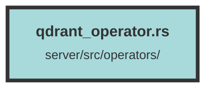

# qdrant_operator.rs


### Purpose
This file contains functions to interact with a Qdrant vector database. It includes functionalities for connecting to Qdrant, creating collections, upserting points, updating points, adding and removing bookmarks, searching, and recommending points and groups.

### Flow
1. **Connection Functions:**
   - `get_qdrant_connection`: Establishes a connection to the Qdrant server using provided or environment variables for URL and API key.

2. **Collection Management:**
   - `create_new_qdrant_collection_query`: Creates a new collection in Qdrant with specified vector configurations and optional quantization. It can also recreate indexes if needed.

3. **Point Management:**
   - `bulk_upsert_qdrant_points_query`: Inserts multiple points into a Qdrant collection.
   - `create_new_qdrant_point_query`: Creates a new point in Qdrant with specified embedding vectors and metadata.
   - `update_qdrant_point_query`: Updates an existing point's metadata or vector in Qdrant.

4. **Bookmark Management:**
   - `add_bookmark_to_qdrant_query`: Adds a bookmark (group ID) to a point in Qdrant.
   - `remove_bookmark_from_qdrant_query`: Removes a bookmark (group ID) from a point in Qdrant.

5. **Search and Recommendation:**
   - `search_over_groups_query`: Searches for points grouped by a specified field, with pagination and filtering options.
   - `search_qdrant_query`: Searches for points in Qdrant based on multiple queries, with pagination and filtering options.
   - `recommend_qdrant_query`: Recommends points based on positive and negative point IDs, with optional filtering and strategy.
   - `recommend_qdrant_groups_query`: Recommends groups of points based on positive and negative point IDs, with optional filtering and strategy.

6. **Utility Functions:**
   - `get_point_count_qdrant_query`: Retrieves the count of points in a Qdrant collection based on specified filters.
   - `point_ids_exists_in_qdrant`: Checks if specified point IDs exist in a Qdrant collection.
```

##### Auto generated documentation file from CodeViz.ai
