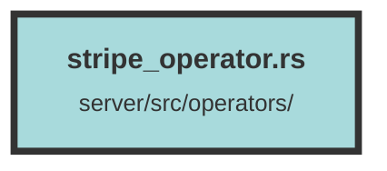

# stripe_operator.rs

### Purpose
This file provides a set of functions to interact with Stripe for managing subscriptions and plans. It includes functionalities for creating, updating, retrieving, and deleting Stripe subscriptions and plans, as well as generating payment links.

### Flow
1. **Stripe Client Initialization**:
   - `get_stripe_client()`: Initializes and returns a Stripe client using the secret key from environment variables.

2. **Subscription Management**:
   - `create_stripe_subscription_query()`: Inserts a new Stripe subscription into the database.
   - `get_subscription_by_id_query()`: Retrieves a Stripe subscription by its ID.
   - `delete_subscription_by_id_query()`: Deletes a Stripe subscription by its ID.
   - `get_option_subscription_by_organization_id_query()`: Retrieves an optional Stripe subscription by organization ID.
   - `set_stripe_subscription_current_period_end()`: Updates the current period end date of a Stripe subscription.
   - `cancel_stripe_subscription()`: Cancels a Stripe subscription via the Stripe API.
   - `update_stripe_subscription_plan_query()`: Updates the plan ID of a Stripe subscription in the database.
   - `update_stripe_subscription()`: Updates the plan of a Stripe subscription via the Stripe API.

3. **Plan Management**:
   - `create_stripe_plan_query()`: Inserts a new Stripe plan into the database.
   - `get_plan_by_id_query()`: Retrieves a Stripe plan by its ID.
   - `get_all_plans_query()`: Retrieves all Stripe plans from the database.

4. **Payment Link Creation**:
   - `create_stripe_payment_link()`: Creates a payment link for a given Stripe plan and organization ID using the Stripe API.

##### Auto generated documentation file from CodeViz.ai
