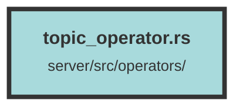

# topic_operator.rs

### Purpose
This file contains asynchronous functions for performing CRUD operations on the `topics` table in a database. These operations include creating, deleting, updating, and retrieving topics, with specific functions tailored to handle topics based on their IDs and owner IDs.

### Flow
1. **create_topic_query**: Inserts a new topic into the `topics` table.
   - Uses `diesel::insert_into` to add a new topic.
   - Returns an error if the insertion fails.

2. **delete_topic_query**: Marks a topic as deleted based on its ID and dataset ID.
   - Uses `diesel::update` to set the `deleted` field to `true`.
   - Returns an error if the update fails.

3. **update_topic_query**: Updates the name and timestamp of a topic based on its ID and dataset ID.
   - Uses `diesel::update` to modify the `name` and `updated_at` fields.
   - Returns an error if the update fails.

4. **get_topic_query**: Retrieves a topic based on its ID and dataset ID, ensuring it is not marked as deleted.
   - Uses `diesel::filter` and `first` to fetch the topic.
   - Returns an error if the topic does not exist.

5. **get_topic_for_owner_id_query**: Retrieves a topic based on its ID, owner ID, and dataset ID, ensuring it is not marked as deleted.
   - Uses `diesel::filter` and `first` to fetch the topic.
   - Returns an error if the topic does not exist for the specified owner ID.

6. **get_all_topics_for_owner_id_query**: Retrieves all topics for a specific owner ID and dataset ID, ensuring they are not marked as deleted.
   - Uses `diesel::filter` and `load` to fetch the topics, ordered by the `updated_at` field in descending order.
   - Returns an error if the retrieval fails.

##### Auto generated documentation file from CodeViz.ai
