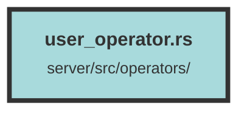

# user_operator.rs

### Purpose
This file contains various asynchronous functions and utilities for managing users, organizations, and API keys within a web application. It includes functions for querying user data, adding users to organizations, updating roles, generating and hashing API keys, and managing user API keys.

### Flow
1. **User Queries**:
   - `get_user_by_id_query`: Fetches a user by their ID along with their associated organizations and roles.
   - `get_user_from_api_key_query`: Retrieves a user based on an API key, using both Blake3 and Argon2 hashing for verification.
   - `get_user_api_keys_query`: Fetches all API keys associated with a user.
   - `create_user_query`: Creates a new user or updates an existing user with a new ID.

2. **User and Organization Management**:
   - `add_existing_user_to_org`: Adds an existing user to an organization with a specified role.
   - `update_user_org_role_query`: Updates the role of a user within an organization.
   - `add_user_to_organization`: Adds a user to an organization and refreshes the Redis cache.
   - `remove_user_from_org_query`: Removes a user from an organization and updates the Redis cache.

3. **API Key Management**:
   - `generate_api_key`: Generates a new API key using random alphanumeric characters.
   - `hash_argon2_api_key`: Hashes an API key using Argon2.
   - `hash_api_key`: Hashes an API key using Blake3.
   - `set_user_api_key_query`: Sets a new API key for a user.
   - `delete_user_api_keys_query`: Deletes a specific API key for a user.

4. **Default User and Organization**:
   - `create_default_user`: Creates a default user and organization if they do not already exist.

5. **Utilities**:
   - `SECRET_KEY` and `SALT`: Static variables for secret key and salt used in hashing.

##### Auto generated documentation file from CodeViz.ai
