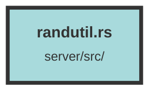

# randutil.rs

### Purpose
The purpose of this file is to generate a random organization name by combining two random words from a predefined list of 4-letter words.

### Flow
1. **Load Words**: The file `4-letter-words.txt` is read, and its lines are collected into a vector `words`.
2. **Random Selection**: Two random indices `a` and `b` are generated using the `rand` crate.
3. **Format Name**: The words at indices `a` and `b` are concatenated with a hyphen to form the organization name.
4. **Return**: The generated name is returned as a `String`.

##### Auto generated documentation file from CodeViz.ai
