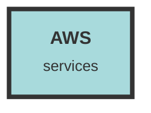

# AWS Service

## Usage Details

### /server/src/handlers/file_handler.rs
This file contains the `upload_file_handler` function, which is responsible for handling file uploads to an S3 bucket. The function decodes the base64-encoded file data, generates a unique file ID, and uploads the file to the specified S3 bucket using the `put_object` method. It also checks for file size limits and handles errors related to file uploads.

### /server/src/lib.rs
This file includes a route definition for obtaining a signed URL for a file stored in S3. The `get_signed_url` function in the `file_handler` module is used to generate a pre-signed URL, allowing temporary access to the file without requiring AWS credentials.

### /server/src/bin/file-worker.rs
The `upload_file` function in this file is responsible for retrieving files from S3, processing them with Tika for HTML conversion, and creating chunks for indexing. It uses the `get_aws_bucket` function to obtain the S3 bucket and the `get_object` method to retrieve the file data.

### /server/src/operators/file_operator.rs
This file defines several functions for interacting with S3:
- `get_aws_bucket`: Configures and returns an S3 bucket instance using environment variables for credentials and bucket details.
- `get_file_query`: Retrieves file metadata from the database and generates a pre-signed URL for accessing the file in S3.
- `delete_file_query`: Deletes a file from both the S3 bucket and the database.

## Additional Notes
- Ensure that the necessary environment variables (`AWS_REGION`, `S3_ENDPOINT`, `S3_BUCKET`, `S3_ACCESS_KEY`, `S3_SECRET_KEY`) are correctly set for the AWS services to function properly.
- Error handling is crucial when dealing with file operations in S3 to ensure data integrity and provide meaningful feedback to the user.
- The use of pre-signed URLs allows secure and temporary access to files without exposing AWS credentials.