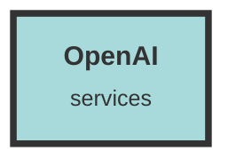

# OpenAI Service

## Usage Details

- **/dashboard/src/types/apiTypes.ts**
  - This file defines the available embedding models hosted by OpenAI. Each model is characterized by its ID, name, URL, and dimension. These models are used to generate text embeddings for various applications within the codebase.

- **/server/src/operators/model_operator.rs**
  - This file contains the `create_embedding` function, which interacts with the OpenAI API to generate embeddings for a given text message. It handles different embedding base URLs and API keys based on the configuration. The function formats the input, sends a request to the OpenAI API, and processes the response to extract the embedding vectors.

- **/server/src/handlers/message_handler.rs**
  - This file includes functions like `get_topic_string` and `stream_response` that utilize OpenAI's chat completion API. These functions create chat messages, set parameters for the chat completion, and send requests to the OpenAI API to generate responses based on the provided prompts and messages.

- **/server/src/handlers/chunk_handler.rs**
  - This file defines the `generate_off_chunks` function, which uses OpenAI's chat API to generate responses based on previous messages and provided chunks of information. It constructs a sequence of chat messages and sends them to the OpenAI API to get a coherent response.

- **/dashboard/src/components/NewDatasetModal.tsx**
  - This file sets the server configuration for embedding models, including the embedding size, model name, query prefix, and base URL. It uses the available embedding models defined in `apiTypes.ts` to configure the embedding settings for new datasets.

- **/server/src/data/models.rs**
  - This file includes data model definitions and conversions related to chat messages. It defines how messages are converted to and from the `ChatMessage` format used by OpenAI's chat API. It also includes the `ServerDatasetConfiguration` struct, which holds configuration details for various services, including OpenAI's embedding and chat APIs.

## Additional Notes
- Ensure that the necessary environment variables (`OPENAI_API_KEY`, `OPENAI_BASE_URL`, etc.) are set correctly to avoid runtime errors.
- The codebase uses different base URLs and API keys depending on the configuration, which allows for flexibility in switching between different embedding and chat services.
- Proper error handling is implemented to manage API request failures and response formatting issues.