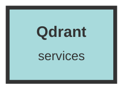

# Qdrant Service

## Usage Details

- **chunk_operator.rs** - This file uses Qdrant to manage chunk metadata. It includes functions to delete chunk metadata and handle chunk collisions by interacting with Qdrant to update or delete points.

- **apiTypes.ts (chat)** - Defines the `ChunkMetadata` interface, which includes a `qdrant_point_id` field to link chunks to their corresponding Qdrant points.

- **group_operator.rs** - This file includes functions to delete groups and their associated chunks, which involves deleting points from Qdrant collections.

- **mod.rs** - Declares the `qdrant_operator` module, making Qdrant-related operations available throughout the codebase.

- **group_handler.rs** - Contains handlers for adding and removing chunks from groups, which involve adding or removing bookmarks in Qdrant.

- **create-new-qdrant.rs** - A script to create a new Qdrant collection, ensuring the necessary indexes and configurations are set up.

- **apiTypes.ts (search)** - Similar to the chat module, this file defines `ChunkMetadata` and `ChunkMetadataWithScore` interfaces, including fields for Qdrant point IDs.

- **lib.rs** - Demonstrates the usage of the `create_new_qdrant_collection_query` function to create a new Qdrant collection.

- **qdrant_operator.rs** - Contains core functions for interacting with Qdrant, such as establishing connections, creating collections, and managing points.

- **search_operator.rs** - Uses Qdrant to perform searches over groups and chunks, assembling filters and conditions for querying Qdrant.

- **schema.rs** - Defines database schemas, including the `chunk_metadata` table, which has a `qdrant_point_id` field to link database records with Qdrant points.

- **dataset_operator.rs** - Includes functions to delete datasets, which involves deleting associated points from Qdrant collections.

- **chunk_handler.rs** - Uses Qdrant to check the existence of point IDs and to recommend chunks based on vector similarity.

- **NewDatasetModal.tsx** - Configures Qdrant collection names based on embedding sizes when setting up new datasets.

- **ingestion-worker.rs** - Handles bulk and individual chunk uploads, including inserting points into Qdrant and managing embeddings.

- **event_handler.rs** - Defines event types, including those related to Qdrant indexing failures.

- **models.rs** - Defines data models, including `ChunkMetadata` and `ChunkMetadataWithScore`, which include fields for Qdrant point IDs.

## Additional Notes
- The integration with Qdrant is crucial for managing and querying vector embeddings, which are essential for the application's functionality.
- Proper error handling and logging are implemented to ensure smooth operations and easier debugging.
- The Qdrant service is configured using environment variables, making it flexible and adaptable to different deployment environments.