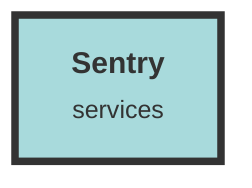

# Sentry Service

## Usage Details
- **chunk_operator.rs** - Sentry is used to create and manage transactions and spans for database operations, ensuring that metadata fetching and collision detection are monitored for performance and errors.
  
- **group_operator.rs** - Sentry captures error messages when there are issues retrieving group IDs from the database, providing detailed error logs for debugging.

- **index.tsx (chat)** - Sentry is initialized for the chat application with specific configurations for tracing and replay integrations, ensuring that client-side errors and performance issues are tracked.

- **index.tsx (dashboard)** - Similar to the chat application, Sentry is initialized for the dashboard with configurations for tracing and replay integrations.

- **file_handler.rs** - Sentry transactions and spans are used to monitor the file upload process, including decoding, uploading to S3, and pushing to Redis, ensuring that each step is tracked for performance and errors.

- **lib.rs** - Sentry is initialized with environment-specific configurations, and integrated with the tracing subscriber for comprehensive error and performance monitoring across the application.

- **qdrant_operator.rs** - Sentry captures error messages when there are issues with inserting chunks into Qdrant, providing detailed logs for debugging.

- **search_operator.rs** - Sentry transactions and spans are used to monitor the process of retrieving and processing Qdrant points, ensuring that each step is tracked for performance and errors.

- **model_operator.rs** - Sentry transactions and spans are used to monitor the creation of embeddings, ensuring that the process is tracked for performance and errors.

- **auth_middleware.rs** - Sentry transactions and spans are used to monitor middleware operations, including user and dataset retrieval, ensuring that each step is tracked for performance and errors.

- **file-worker.rs** - Sentry is initialized and used to monitor the file worker process, including file uploads and chunk processing, ensuring that each step is tracked for performance and errors.

- **search/index.tsx** - Sentry is initialized for the search application with specific configurations for tracing and replay integrations, ensuring that client-side errors and performance issues are tracked.

- **file_operator.rs** - Sentry captures error messages when there are issues with creating or getting an AWS S3 bucket, providing detailed logs for debugging.

- **chunk_handler.rs** - Sentry transactions and spans are used to monitor the chunk search process, ensuring that each step is tracked for performance and errors.

- **ingestion-worker.rs** - Sentry is initialized and used to monitor the ingestion worker process, including bulk uploads and chunk processing, ensuring that each step is tracked for performance and errors.

- **errors.rs** - Sentry captures error messages for various service errors, providing detailed logs for debugging and ensuring that all errors are tracked.

## Additional Notes
- Sentry's integration with tracing and logging libraries ensures comprehensive monitoring and error tracking across both client-side and server-side components.
- The use of transactions and spans allows for detailed performance monitoring, helping to identify bottlenecks and optimize the application's performance.
- Environment-specific configurations ensure that Sentry is only enabled in appropriate environments, such as production, to avoid unnecessary overhead during development.