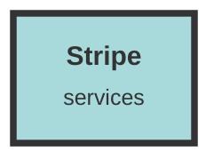

# Stripe Service

## Usage Details

- **/server/src/handlers/mod.rs** - This file includes the `stripe_handler` module, which contains the main logic for handling Stripe-related webhooks and endpoints.

- **/dashboard/src/types/apiTypes.ts** - Defines TypeScript interfaces for `StripePlan` and `StripeSubscription`, which are used to type-check data related to Stripe plans and subscriptions in the frontend.

- **/server/src/handlers/dataset_handler.rs** - Utilizes `StripePlan` to enforce dataset limits based on the organization's subscription plan. If the dataset count exceeds the plan's limit, an upgrade is required.

- **/server/src/handlers/stripe_handler.rs** - Contains the main logic for handling Stripe webhooks, such as `CheckoutSessionCompleted`, `PlanCreated`, and `CustomerSubscriptionDeleted`. It processes these events to create or update subscriptions and plans in the database.

- **/server/src/operators/stripe_operator.rs** - Implements functions to interact with the database for creating and managing Stripe subscriptions and plans. It also includes a function to create a Stripe payment link.

- **/server/src/operators/mod.rs** - Includes the `stripe_operator` module, which contains the database interaction logic for Stripe.

- **/dashboard/src/components/PlansTable.tsx** - Fetches available Stripe plans and manages the current subscription plan for the organization. It includes functions to cancel or update the subscription plan.

- **/server/src/lib.rs** - Registers the Stripe-related endpoints, such as directing to the payment link, canceling subscriptions, and updating subscription plans.

- **/server/src/operators/organization_operator.rs** - Manages the deletion of organizations and ensures that active subscriptions are handled appropriately. It also fetches organization details along with their subscription and plan information.

- **/server/src/data/schema.rs** - Defines the database schema for `stripe_plans` and `stripe_subscriptions` tables, which store information about Stripe plans and subscriptions.

- **/server/src/handlers/auth_handler.rs** - Checks the user limit for an organization based on its subscription plan when creating a new account.

- **/server/src/operators/dataset_operator.rs** - Fetches dataset and organization details, including subscription and plan information, to enforce limits based on the subscription plan.

- **/chat/src/types/actix-api.ts** - Defines TypeScript interfaces for Stripe checkout session responses and user plans, used to type-check data related to Stripe in the chat module.

- **/server/src/data/models.rs** - Defines the Rust structs for `StripePlan` and `StripeSubscription`, which are used to map database records to Rust types.

## Additional Notes
- The integration with Stripe is critical for managing billing and subscription features within the application. Proper handling of webhooks and database interactions ensures that subscription data remains consistent and up-to-date.
- Environment variables such as `STRIPE_SECRET` and `STRIPE_WEBHOOK_SECRET` are used to securely interact with the Stripe API. Ensure these are correctly set in the deployment environment.